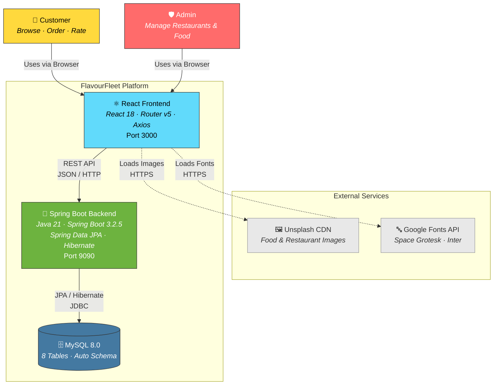
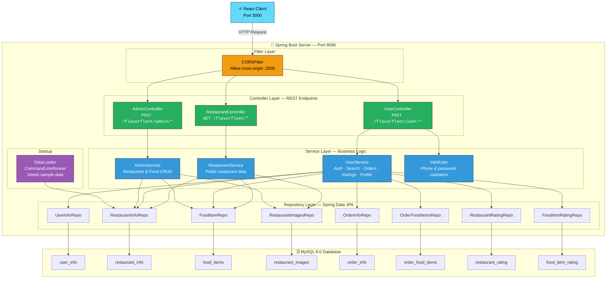

<div align="center">

# 🚀 FlavourFleet

### A Full-Stack Food Delivery Platform

[](https://openjdk.org/)
[](https://spring.io/projects/spring-boot)
[](https://reactjs.org/)
[](https://www.mysql.com/)

> *Discover the best food & drinks, delivered fast to your doorstep*

[Getting Started](#-getting-started) · [Features](#-features) · [API Reference](#-api-reference) · [Architecture](#-full-system-architecture)

---

</div>

## 📋 Table of Contents

- [About](#-about)
- [Tech Stack](#-tech-stack)
- [Features](#-features)
- [Full System Architecture](#-full-system-architecture)
  - [High-Level Architecture](#-high-level-architecture-system-context)
  - [Low-Level Architecture](#-low-level-architecture-backend-internals)
- [Getting Started](#-getting-started)
- [Database Setup](#-database-setup)
- [Running the Application](#-running-the-application)
- [API Reference](#-api-reference)
- [Postman Testing](#-postman-testing)
- [User Roles](#-user-roles)
- [Configuration](#-configuration)

---

## 🎯 About

**FlavourFleet** is a complete food delivery platform showcasing **Java** and **Spring Boot** backend development skills. The project features a robust REST API backend built with **Spring Boot**, **Spring Data JPA**, and **Hibernate**, paired with a **React** frontend. It supports two user roles — **Customers** and **Admins** — with full CRUD operations on restaurants and food items, search, order placement, order history, rating system, and profile management.

---

## 🛠 Tech Stack

| Layer | Technology |
|-------|-----------|
| **Backend** | Java 21, Spring Boot 3.2.5, Spring Data JPA, Hibernate, REST APIs |
| **Database** | MySQL 8.0 |
| **Frontend** | React 18, React Router v5, Axios, CSS3 |
| **Build Tools** | Maven (backend), npm (frontend) |
| **Libraries** | Lombok 1.18.30, React Icons |

---

## ✨ Features

### 👤 Customer Features

| Feature | Description |
|---------|-------------|
| 🔐 **Sign Up & Login** | Phone number based authentication with password |
| 🔑 **Forgot Password** | Security question based password recovery |
| 👤 **Profile Dropdown** | View name, phone number, change password, logout — from avatar in navbar |
| 🏪 **Browse Restaurants** | View all restaurants with real ratings and images |
| 🍕 **View Menus** | Food items with images, descriptions, prices, and ratings |
| 🔍 **Search** | Search food items and restaurants by name |
| 🛒 **Place Orders** | Select items, set quantities, add more items to same order |
| 📦 **Order History** | View all past orders with rated/unrated status |
| ⭐ **Rate Orders** | Rate restaurant and individual food items after placing order |

### 🛡️ Admin Features

| Feature | Description |
|---------|-------------|
| 📊 **Dashboard** | Restaurant count, food item stats, sidebar navigation |
| 👤 **Admin Profile** | Profile dropdown with name, phone, admin badge, change password, logout |
| 🏪 **Add / Edit / Delete Restaurant** | Full CRUD on restaurants with image URLs |
| 🍕 **Add / Edit / Delete Food Items** | Full CRUD on food items with auto-image matching |
| 🖼️ **Smart Image Matching** | Auto-assigns food images based on dish name (100+ mappings) |

---

## 🏗 Full System Architecture

### 🔵 High-Level Architecture (System Context)

> Shows the big picture — users, systems, and external services.



---

### 🟢 Low-Level Architecture (Backend Internals)

> Deep dive into the Spring Boot backend — layers, classes, and data flow.



---

### Key Backend Patterns

| Pattern | Implementation |
|---------|---------------|
| **Layered Architecture** | Controller → Service → Repository → Database |
| **DTO Pattern** | `RestaurantDetails`, `FoodItemDetails`, `SearchFoodItem` for API responses |
| **Entity Relationships** | `@OneToMany` / `@ManyToOne` with JPA & Hibernate (cascade) |
| **Data Seeding** | `DataLoader` (CommandLineRunner) inserts sample data on startup |
| **CORS Handling** | Custom `CORSFilter` for cross-origin React ↔ Spring Boot communication |
| **Input Validation** | `ValidUser` service validates phone numbers & passwords |
| **Auto Schema** | Hibernate auto-generates tables via `ddl-auto=update` |

---

## 🚀 Getting Started

### Prerequisites

| Tool | Version | Check Command |
|------|---------|---------------|
| **Java JDK** | 21+ | `java --version` |
| **Node.js** | 16+ | `node --version` |
| **npm** | 8+ | `npm --version` |
| **MySQL** | 8.0+ | `mysql --version` |
| **Git** | Any | `git --version` |

### Clone the Repository

```bash
# Step 1: Clone the project
git clone https://github.com/shivam-tamboli/-FlavourFleet.git

# Step 2: Navigate into the project folder
cd -FlavourFleet
```

---

## 🗄 Database Setup

### Step 1: Create the database

```sql
CREATE DATABASE flavorfleet;
```

> Hibernate will auto-create all tables on first run (`spring.jpa.hibernate.ddl-auto=update`).

### Step 2: Configure credentials

Edit `backend/src/main/resources/application.properties`:

```properties
spring.datasource.url=jdbc:mysql://localhost:3306/flavorfleet
spring.datasource.username=root
spring.datasource.password=YOUR_PASSWORD_HERE
```

### Step 3: Configure backend port (optional)

The backend runs on port **9090** by default. To change it, edit `application.properties`:

```properties
server.port=9090
```

If you change the backend port, also update `frontend/src/config/api.js`:

```javascript
const API_BASE_URL = "http://localhost:YOUR_PORT";
```

### Database Schema (auto-generated)

| Table | Description |
|-------|-------------|
| `user_info` | Users — id, name, phone, password, role (0=admin, 1=user), login_status |
| `restaurant_info` | Restaurants — id, name, address, rating, num_of_rating |
| `restaurant_images` | Restaurant images — id, link, restaurant_id (FK) |
| `food_items` | Food items — id, name, description, price, image, rating, restaurant_id (FK) |
| `order_info` | Orders — id, user_id, restaurant_id, total_amount, delivery_address, order_flag |
| `order_food_items` | Order line items — id, food_name, price, quantity, order_id (FK) |
| `restaurant_rating` | Restaurant ratings — id, rating, restaurant_id, user_id |
| `food_item_rating` | Food item ratings — id, rating, food_item_id, user_id |

---

## ▶️ Running the Application

### Terminal 1 — Backend

```bash
cd backend
./mvnw spring-boot:run
```
> Starts at `http://localhost:9090`

### Terminal 2 — Frontend

```bash
cd frontend
npm install    # first time only
npm start
```
> Starts at `http://localhost:3000`

### Open the App

| URL | Page |
|-----|------|
| `http://localhost:3000` | 🏠 Home / Welcome |
| `http://localhost:3000/Login` | 🔐 Login |
| `http://localhost:3000/Signup` | 📝 Sign Up |
| `http://localhost:3000/Admin` | 🛡️ Admin Dashboard |

---

## 👥 User Roles

### Creating an Admin Account

1. Go to `/Signup`
2. Fill in all fields
3. In the **"Admin Code"** field, enter: **`FLAVOURFLEET2026`**
4. Click "Create Account" → Login → Redirected to **Admin Dashboard**

### Creating a Customer Account

1. Go to `/Signup`
2. Fill in all fields, leave **Admin Code** blank
3. Login → Redirected to **Restaurants** page

| Role | Value | Redirect | Capabilities |
|------|-------|----------|-------------|
| **Admin** | `0` | `/Admin` | Manage restaurants & food items |
| **Customer** | `1` | `/Userrestaurant` | Browse, order, rate |

### Profile Dropdown (Both Roles)

On both user and admin sides, clicking the **avatar** in the navbar opens a dropdown showing:

- **Name** and **Phone Number** (fetched from `/get-profile` API)
- **Change Password** → navigates to Forgot Password page
- **Logout** → clears session and redirects to home

Admin dropdown also shows an **Admin** role badge.

---

## 📡 API Reference

### Public Endpoints

| Method | Endpoint | Description |
|--------|----------|-------------|
| `GET` | `/flavorfleet/get-restaurants` | Get all restaurants |

### User Endpoints (`/flavorfleet/user/`)

| Method | Endpoint | Description |
|--------|----------|-------------|
| `POST` | `/signup` | Register user |
| `POST` | `/login` | Login |
| `POST` | `/logout` | Logout |
| `POST` | `/forgot-password` | Get security question |
| `POST` | `/reset-password` | Reset password |
| `POST` | `/get-profile` | Get user name, phone, address, role |
| `POST` | `/search-by-name` | Search restaurants by name |
| `POST` | `/search-by-fooditem` | Search food items |
| `POST` | `/place-order` | Place order |
| `POST` | `/get-all-order-details` | Get order history |
| `POST` | `/rate-order` | Rate order |
| `POST` | `/get-fooditems` | Get food items by restaurant |
| `GET` | `/get-all-food-items` | Get all food items |
| `GET` | `/get-all-restaurants` | Get all restaurants |

### Admin Endpoints (`/flavorfleet/admin/`)

| Method | Endpoint | Description |
|--------|----------|-------------|
| `POST` | `/add-restaurant` | Add restaurant |
| `POST` | `/edit-restaurant` | Edit restaurant |
| `POST` | `/delete-restaurant` | Delete restaurant |
| `POST` | `/add-fooditems` | Add food item |
| `POST` | `/edit-fooditems` | Edit food item |
| `POST` | `/delete-fooditems` | Delete food item |

---

## 🧪 Postman Testing

You can test all APIs using **Postman**. Here are some examples:

### Check if backend is running

- **Method:** `GET`
- **URL:** `http://localhost:9090/flavorfleet/get-restaurants`

### Signup

- **Method:** `POST`
- **URL:** `http://localhost:9090/flavorfleet/user/signup`
- **Body (JSON):**
```json
{
  "name": "John Doe",
  "phonenumber": "9876543210",
  "address": "123 Main St",
  "secretquestion": "What city?",
  "answer": "Mumbai",
  "password": "pass123"
}
```

### Admin Signup (with admin code)

- **Method:** `POST`
- **URL:** `http://localhost:9090/flavorfleet/user/signup`
- **Body (JSON):**
```json
{
  "name": "Admin User",
  "phonenumber": "9999999999",
  "address": "Admin HQ",
  "secretquestion": "What city?",
  "answer": "Delhi",
  "password": "admin123",
  "admincode": "FLAVOURFLEET2026"
}
```

### Login

- **Method:** `POST`
- **URL:** `http://localhost:9090/flavorfleet/user/login`
- **Body (JSON):**
```json
{
  "phonenumber": "9999999999",
  "password": "admin123"
}
```
- **Response:** `Success_admin` or `Success_user`

### Get User Profile

- **Method:** `POST`
- **URL:** `http://localhost:9090/flavorfleet/user/get-profile`
- **Body (JSON):**
```json
{
  "phonenumber": "9999999999"
}
```
- **Response:**
```json
{
  "name": "Admin User",
  "phone": "9999999999",
  "address": "Admin HQ",
  "role": "0"
}
```

### Search Food Items

- **Method:** `POST`
- **URL:** `http://localhost:9090/flavorfleet/user/search-by-fooditem`
- **Body (JSON):**
```json
{
  "search": "pizza"
}
```

---

## 🔧 Configuration

### Backend Port

The backend server runs on **port 9090** by default. This is configured in:

```
backend/src/main/resources/application.properties
```

### Frontend API Base URL

All frontend API calls use a centralized configuration file:

```
frontend/src/config/api.js
```

```javascript
const API_BASE_URL = "http://localhost:9090";
```

> **Note:** If you change the backend port, update this file to match.

---

## 📄 License

This project is for educational purposes. Built with ❤️ to demonstrate Java & Spring Boot backend development skills.

---

<div align="center">

**Built with 🚀 by [Shivam Tamboli](https://github.com/shivam-tamboli)**

*Java 21 · Spring Boot 3.2.5 · Spring Data JPA · Hibernate · MySQL · REST APIs · React*

</div>
